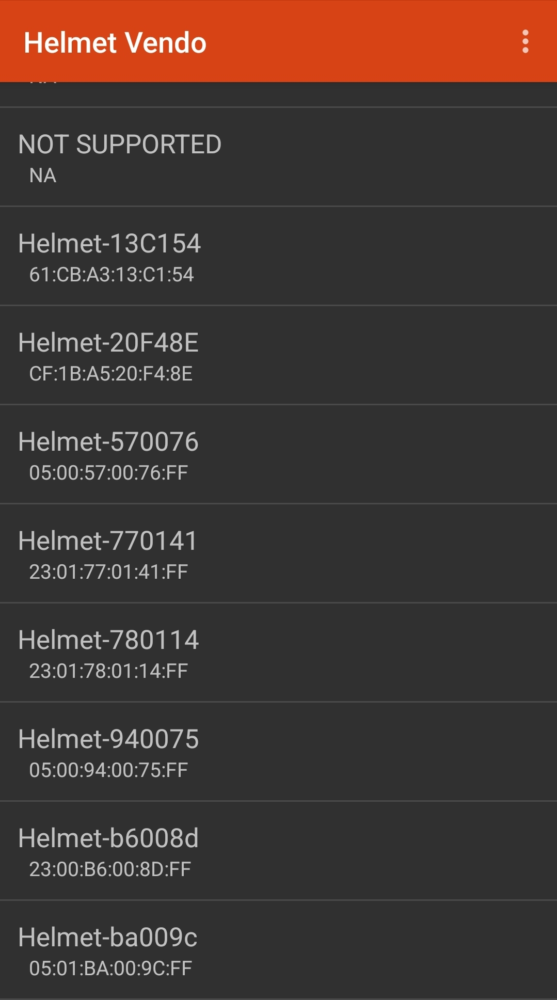
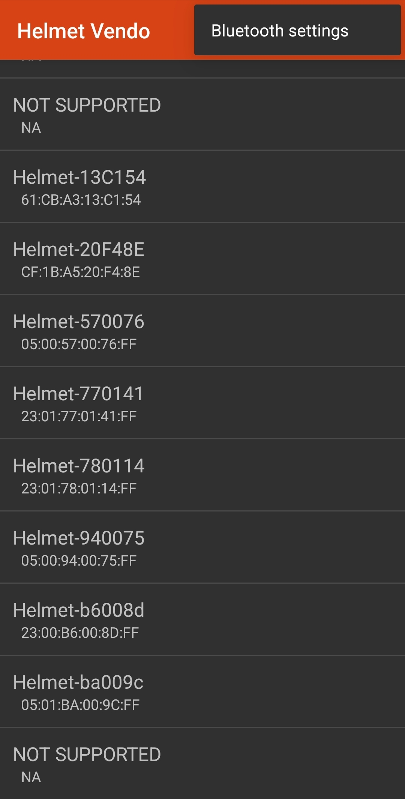
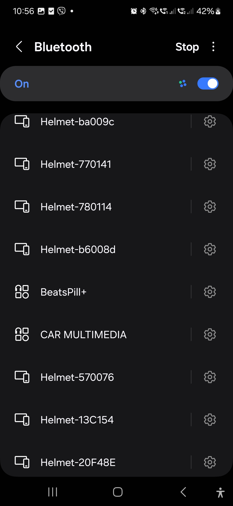
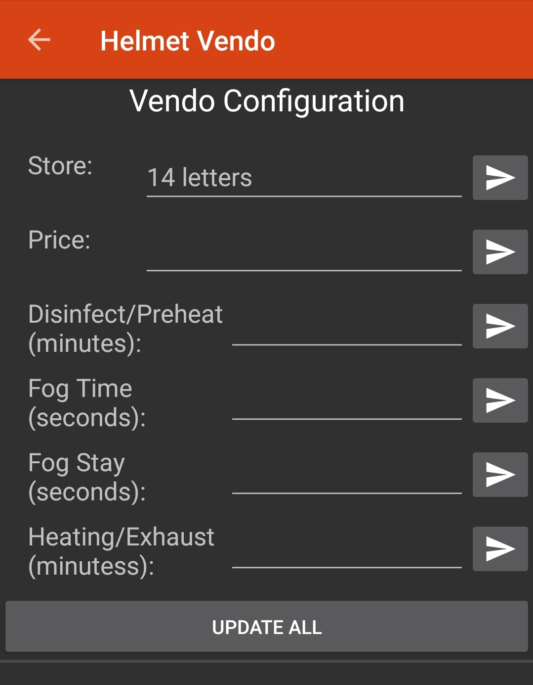

# Youtube video on how to setup

# Download App
To download the latest app for 3 stage, please click:
[Download Helmet Vendo App](https://github.com/arclem888/helmetvendoapp/releases/download/v3.1.0/HelmetVendo3stage.apk)

# How to use the app.
## 1. Open App and choose the corresponding bluetooth if already paired. Hold the blue button on the kit then press the red button and wait for BT enabled to appear.

## 2. If not click the 3 dots on the top right and click bluetooth settings

## 3. Choose the bluetooth Id and click it to pair

## 4. Go back to the bluetooth list again by pressing back. you can now see the bluetooth on the list and click it.

## 5. Configure the settings needed and press update all. After all if ok. Press the red button to reset the device.

